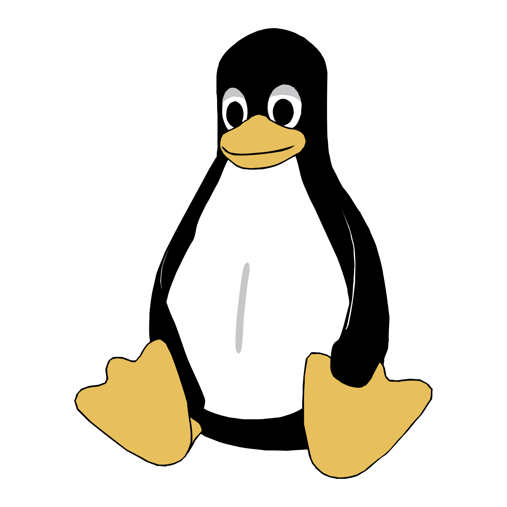

    <h1> 🇫🇷 Bonsoir 👋 </h1>
    I'm Tanguy Maraux, a french IT student at <a href="https://github.com/epita">Epita</a>.
    Take a look at my personal <a href="https://tanguymaraux.com/">website portfolio</a>.
     
     

    <h2>🔧 Technologies I'm using :</h2>
    <code></code>
    <code></code>
    <code></code>
    <code></code>
    <code></code>
    <code></code>
    <code></code>
    <code></code>
    <code></code>
    <code></code>
    <code></code>
    <code></code>
    <code></code>
    <code></code>
    <code></code>
    <code></code>
     
     

    <h2>🔥 Some stats 🔥</h2>
    
     
    

<h2>✨ Contact ✨</h2>
    <code><a href="mailto:tanguy.maraux@gmail.com" title="Email"> Mail</a></code>
    <code><a href="https://www.linkedin.com/in/tanguy-maraux-1555041b0/" title="LinkedIn Profile" target="_blank" rel="noopener noreferrer"> LinkedIn</a></code>
    <code><a href="https://www.instagram.com/guytanlalegende/" title="Instagram Profile" target="_blank" rel="noopener noreferrer"> Instagram</a></code>
    <code><a href="https://twitter.com/Guytanlalegende" title="Twitter Profile" target="_blank" rel="noopener noreferrer"> Twitter</a></code>

